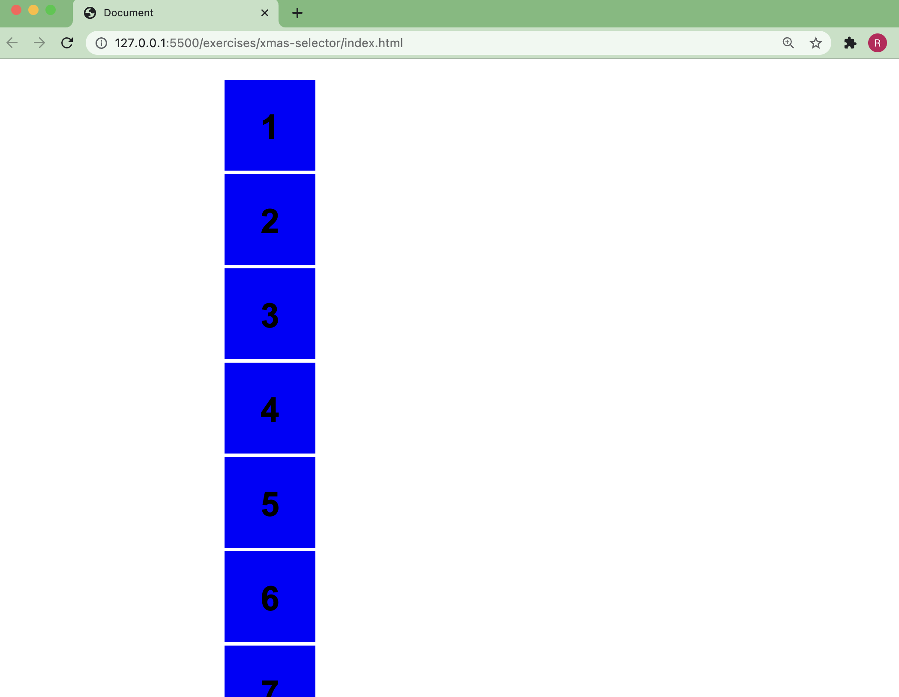
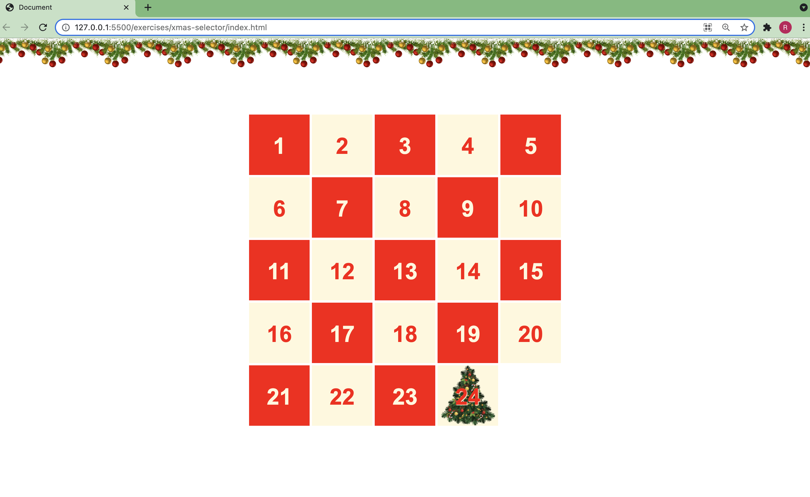

# XMAS Selector

- Die vorbereiteten Dateien `index.html` und `dont-touch.css` enthalten 24 `div`-Elemente mit der Klasse `square`
- Die Ausgangsversion sieht so aus: 
- Das Ziel ist es, einen Adventskalender zu erzeugen, der so aussieht: 
- **WICHTIG:** Ihr dürft weder die `index.html` noch die `dont-touch.css` ändern! Arbeitet bitte ausschließlich in der `styles.css`
- Das Bild für Feld 24 findet ihr unter [`assets/christmas-tree.png`](assets/christmas-tree.png)
- Die verwendeten Farben sind `red` und `cornsilk`
- Recherchetipp: [CSS Selectors auf W3Schools](https://www.w3schools.com/cssref/css_selectors.asp)
