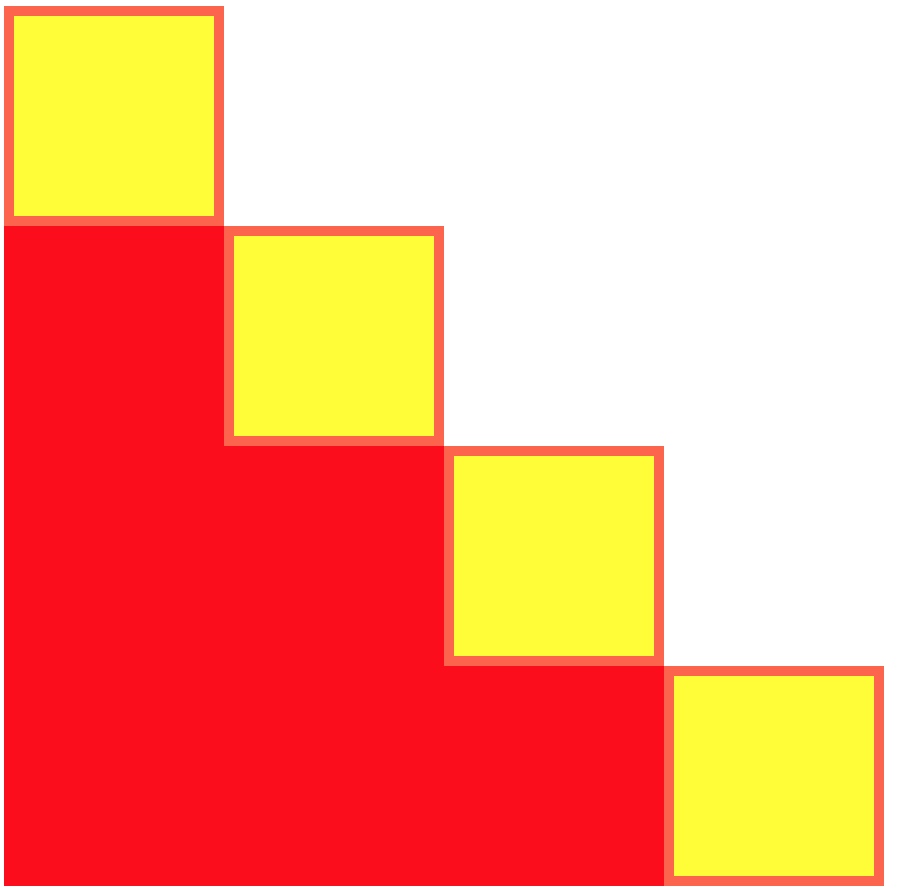

# Stairway To Heaven

Build a staircase with divs! 

Apply `width`, `height`, `background-color`, `margin` (no `padding`!) and `box-sizing`.

It should look like the reference image below.

Now, build another staircase applying the same properties **except** this time use `padding` and not `margin`.

It should look like the reference image below.

Good luck and have fun!
