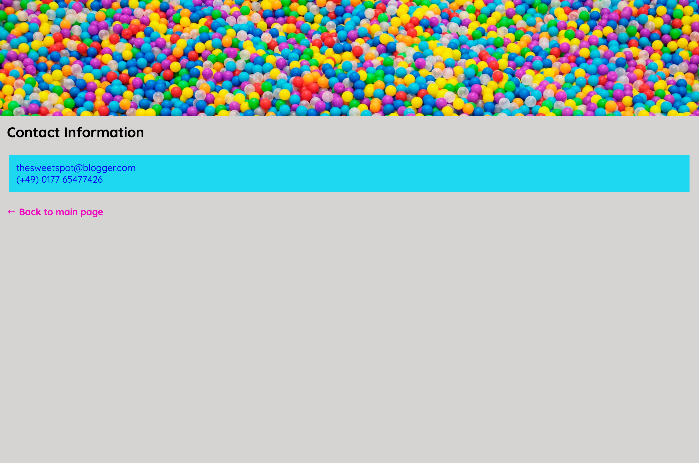

# The Sweet Spot v4

Wir arbeiten weiter an unserer **The Sweet Spot** Seite und nehmen uns Schriftarten, Textstyling und Icons vor...

#### Main Page

#### Contact Page

#### Tab

### Anleitung

> - Benutze die `:root` **pseudo-class**, setze `font-size` auf den Wert `62.5%`. Überarbeite Dein css und ersetze Schriftgrößen, die mit `px` definiert sind mit `rem` (oder `em`).
> - Füge das `lollipop.ico` im `images` Verzeichnis als favicon hinzu - vergiss die Kontaktseite nicht!
> - Importiere die **Quicksand** und **Monoton** Fonts aus **Google Fonts** und verwende sie gemäß den Referenz-Screenshots.
> - Füge `text-shadow` zum `h1` Element im `header` hinzu, um den Outline Effekt aus den Referenz-Screenshots zu erzielen.
> - Füge der Seite die Icons **candy cane** und **cookie** aus **Fontawesome** hinzu.
> - Benutze das `::after` **pseudo-element**, um das **cookie** Icon nach den Überschriften zu setzen
> - Benutze das **back arrow** Icon für den '**Back to main page**' Link auf der Kontaktseite
