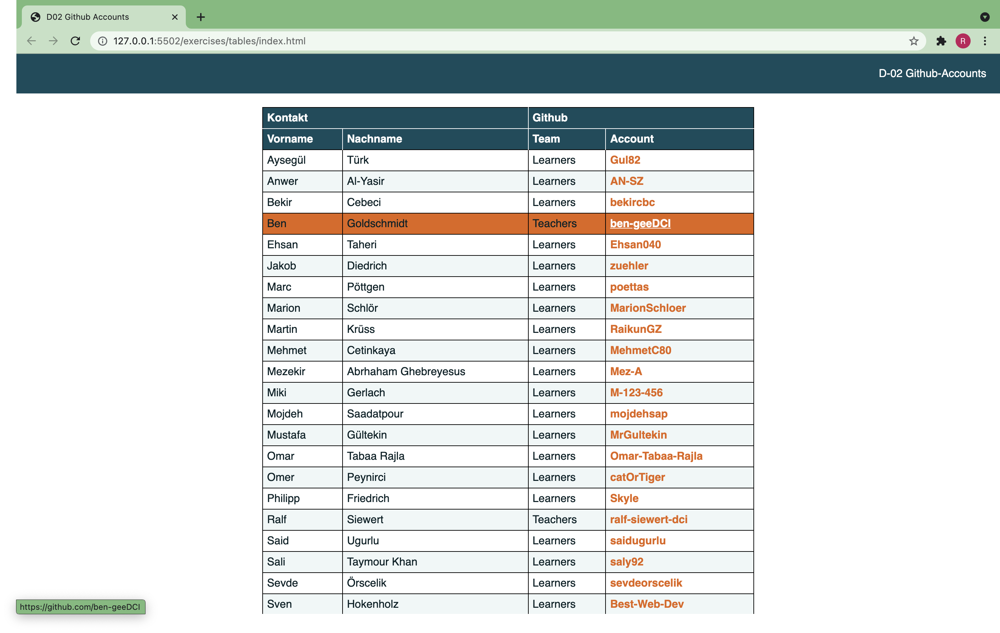

## D02 Github Accounts

Erstellt eine Tabelle der Mitglieder unserer Github-Organisation mit Vorname, Nachname, Github-Team (Learners/Teachers) und Github-Account.
Ihr müsst **NICHT** alle Mitglieder listen, vier bis fünf reichen aus.

Achtet auf Folgendes:

- Sucht Euch eine eigene Farbpalette aus (Background-, Text- und Akzentfarbe) und verwendet CSS Variables, um auf die Farben zuzugreifen
- Verwendet eine sehr helle Variation der Backgroundfarbe als "Zebra"-Muster-Farbe in der Tabelle
- Verwendet eine Sans-Serif-Schrift Eurer Wahl
- Der Header soll wie im Screenshot aus zwei Zeilen bestehen, die erste Zeile gruppiert die Informationen
- Achtet darauf, dass die Header-Zellen weiße Umrandungen haben
- Links sollen nur bei `:hover` unterstrichen sein
- Achtet auf die Invertierung der Link-Farbe beim `:hover` über Zeilen
- Verwendet semantische Tags!
