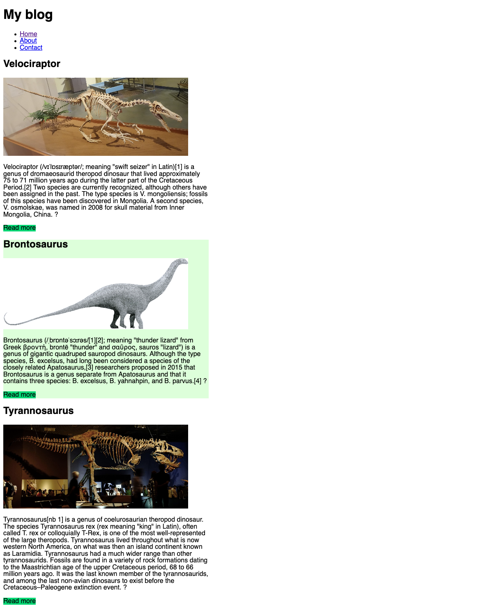
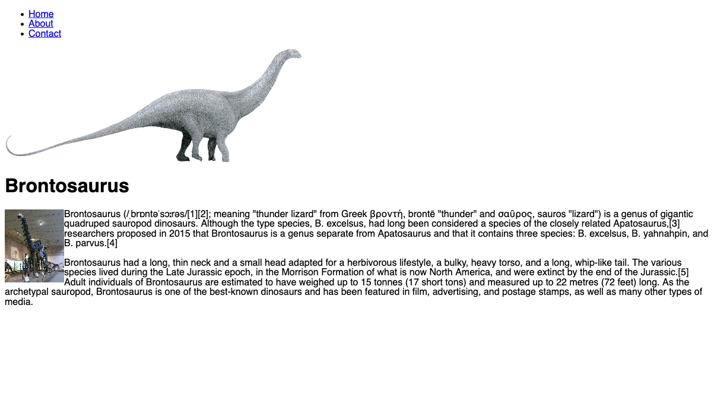

# Build a Blog

- Create an `index.html` page and a `posts` directory containing your blog posts
- Inside the posts directory create a HTML file for each post, for example `post-1.html`, `post-2.html` etc. Create at least 3 posts
- In the `index.html` list all the posts available, showing the main picture, title, and the first few lines of content. At the end, put a `read more` link that points to the full blog post
- Inside each individual post page, put the main image, the title, the full content and some extra images
- Add a link to each post page to return to the home page

Notes:

- Copy the content from some wikipedia page, or from whatever source you prefer, but try to give it a theme. Some ideas:
  - a blog about your favourite video games
  - a blog about your favourite tv series
  - a blog about your favourite cartoons or anime
  - a blog about comics
  - a blog about your favourite bands
- Try to use as many things you learned as possile
  - put some floating image in the text
  - add some background color
  - add colored links
- Use the examples below as a reference, but try to come up with your own style ideas

### Homepage

---

### Single post page

---

